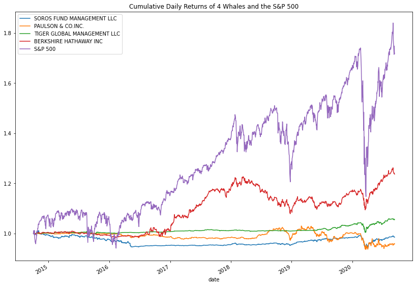
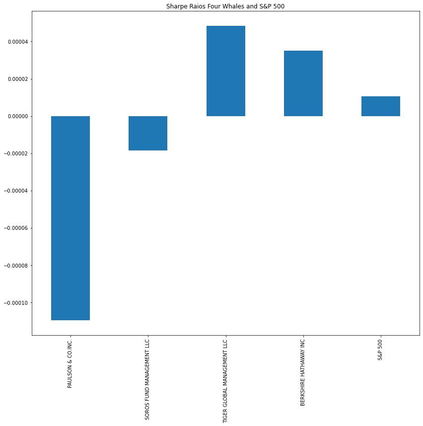
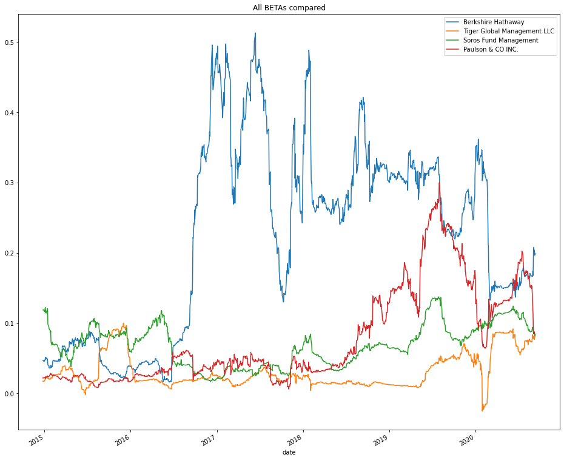

# Quantitative Portfolio Analysis
In this repository, I will evaluate `Berkshire Hathaway`, `Paulson & CO`, `Tiger Global Management` and `Soros Fund Management` as prospects for my ficticious companies portfolio management services.
## I analyzed the following:
1. Performance: In daily percentage returns
2. Risk: In variance and standard deviation
3. Volatility: Visually, via box plots and via BETA metric
4. Risk-Return: Via Sharpe Ratios
---
## Analysis at a glance
### Performance

### Risk

### Risk-Return

### Bars in order: Paulson, Soros, Tiger, Berkshire, S&P 500
### Supplementary Student Analysis

