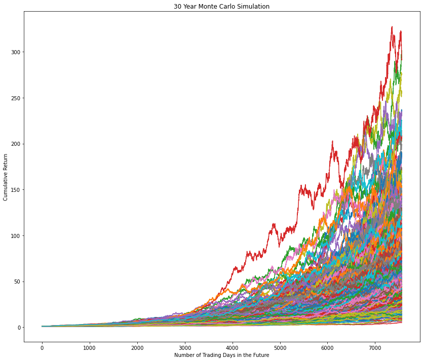
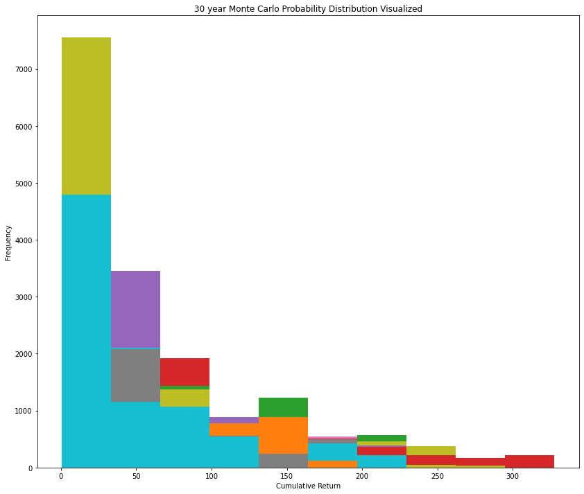

# Module 5 Challenge
## APIs and Monte Carlo Simulations
---
### Portfolio Visualizations
1. `40%` Bonds and `60%` Stocks
---
### 30 Year, 500 Monte Carlo Simulations

#### Probability Distribution

---
2. `20%` Bonds and `80%` Stocks
