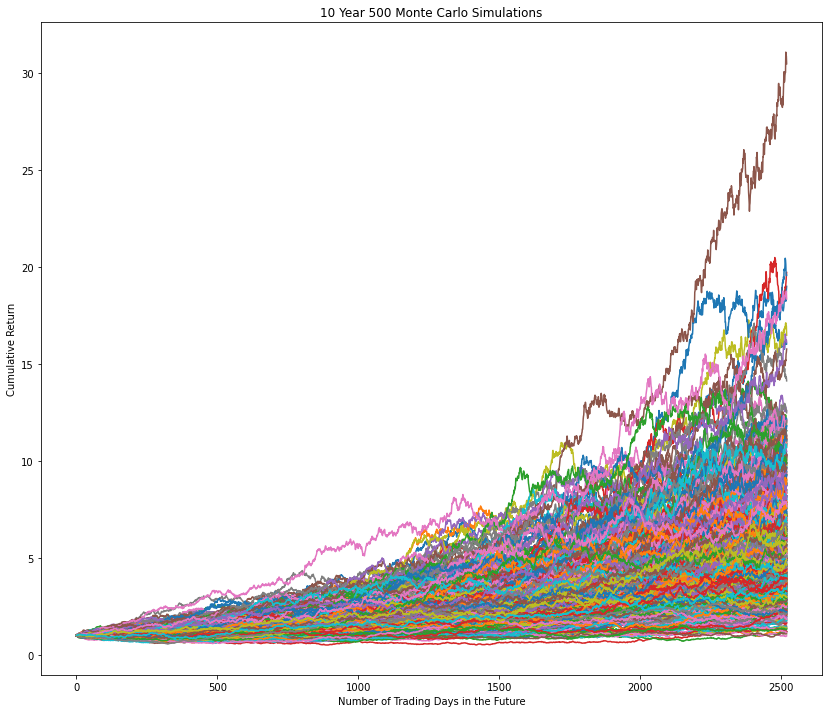
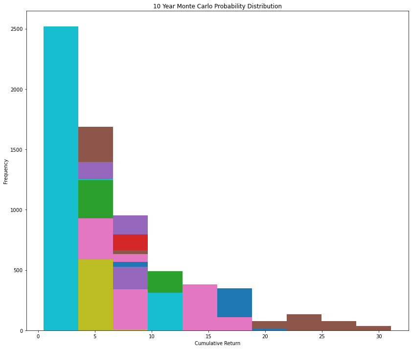
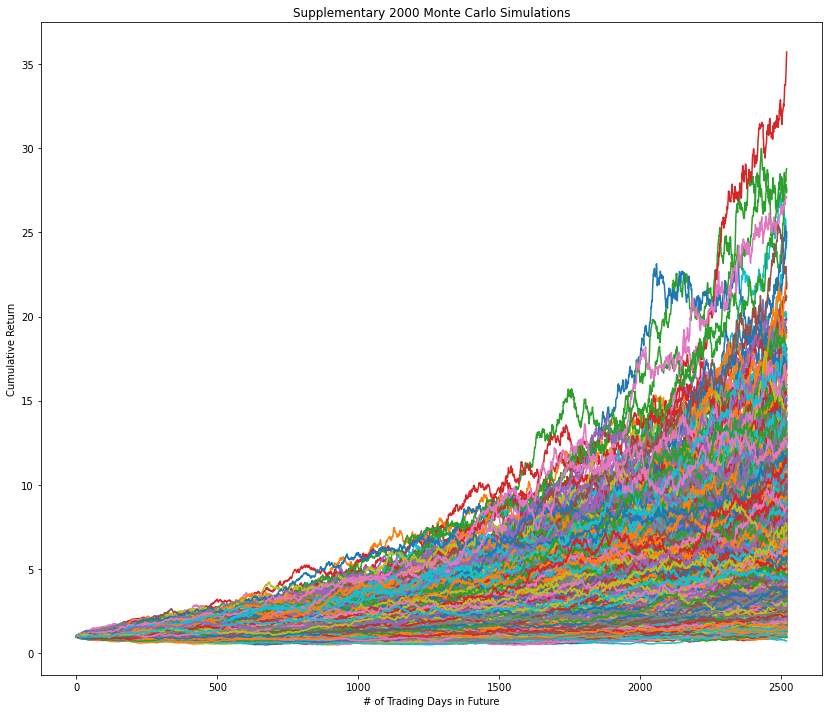

# Module 5 Challenge
## APIs and Monte Carlo Simulations
---
If you have dark theme enabled in your browser, please *DISABLE* it to see read the axis. :)
### Portfolio Visualizations
1. `40%` Bonds and `60%` Stocks
---
### 30 Year, 500 Monte Carlo Simulations

#### Probability Distribution

---
2. `20%` Bonds and `80%` Stocks

# Supplementary Student Analysis
I was curious, so I re-ran the 10 Year Monte Carlo Simulation, this time with 2000, instead of 500. While it took a while more, the numbers came out roughly the same.

